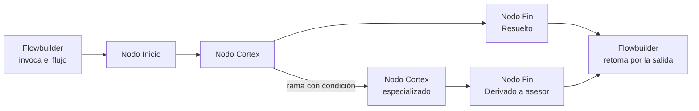

# 1. Fundamentos

## Qué es Cortex y cuándo usarlo

> Estado en el manual original: **Borrador** · Tipo: Concepto

> **En una línea:** Cortex es el constructor de agentes conversacionales de Atom. Permite armar un flujo visual de nodos que razonan con IA e insertarlo como un nodo dentro de Flowbuilder.
> 

## Para qué sirve

Cortex se usa para conversaciones que no se pueden guionar de antemano.

Un flujo de Flowbuilder define cada paso por adelantado: cada respuesta posible del cliente lleva a un camino previsto. Cortex cubre el caso contrario, cuando el cliente escribe libremente, cambia de tema, consulta información que está en documentos o hace varias preguntas en un mismo mensaje.

Un Flujo Cortex se arma en un canvas visual. Cada Nodo Cortex es un momento de la conversación, con su propio prompt, sus herramientas y su base de conocimiento. Los nodos se conectan mediante ramas con condiciones escritas en lenguaje natural, y el LLM determina en runtime cuál corresponde. Al terminar, la conversación sale por un Nodo Fin, que Flowbuilder recibe como una salida.

## Cuándo usar Cortex y cuándo Flowbuilder

La primera decisión es si el caso requiere IA.

| Flowbuilder | Cortex |
| --- | --- |
| El recorrido es lineal y predecible | La conversación puede tomar cualquier dirección |
| El cliente responde con botones u opciones cerradas | El cliente escribe libremente |
| No requiere interpretar texto libre | Requiere entender intención, no palabras clave |
| La información ya está en variables del flow | La información está en documentos, tablas o sistemas externos |
| Campañas, recordatorios, encuestas, notificaciones | Soporte, calificación de leads, agendamiento, cotización |

> 💡
> Cada turno de un Nodo Cortex implica una llamada a un LLM, con costo en tokens y latencia asociada. Para casos lineales, Flowbuilder rmás rápido y más predecible.

## Combinación de ambos

En la mayoría de las implementaciones se usan los dos productos juntos: Flowbuilder orquesta el proceso completo y Cortex resuelve los tramos que requieren interpretación.

Ejemplo de una campaña saliente:

1. Flowbuilder envía la plantilla de WhatsApp.
2. El Nodo Cortex atiende la respuesta del cliente hasta agendar o descartar.
3. Flowbuilder retoma según la salida por la que terminó el nodo: asigna a un asesor, actualiza el CRM o programa un re-contacto.

## Qué incluye Cortex

- **Canvas multi-nodo** con ramas condicionales en lenguaje natural.
- **Conocimiento:** documentos con RAG y tablas dinámicas para datos que cambian.
- **Herramientas:** aplicaciones externas con autenticación, HTTP Request, Code Tool y MCP Servers.
- **Clasificación automática** de cada conversación en etapas del funnel, tipificaciones y etiquetas.
- **Simulador y evaluaciones multi-turno** para validar antes de publicar.
- **Trazabilidad completa** de cada conversación, consultable después del cierre.

## Relacionado

- 1.2 Glosario de Cortex
- 1.3 Anatomía de un flujo Cortex
- 9.1 El Nodo Cortex en Flowbuilder
- 10.1 Diseñar el flujo antes de construirlo

---

*Fuente: Buenas prácticas §2 · Última revisión: 06/08/2026 · Responsable: Constanza Molina*

---

## Glosario de Cortex

> Estado en el manual original: **Borrador** · Tipo: Referencia

> **En una línea:** los términos que usa la documentación de Cortex, con la equivalencia.
> 

## Estructura del flujo

| Término | Qué es |
| --- | --- |
| **Cortex** | El producto donde se construyen los agentes conversacionales.  |
| **Flujo Cortex** | El conjunto completo que se arma en el canvas: todos sus nodos, ramas y configuración. Es la unidad que se publica y que Flowbuilder invoca. |
| **Canvas** | La superficie visual donde se componen los nodos del flujo. |
| **Nodo Cortex** | Un momento de la conversación con su propio prompt, herramientas y base de conocimiento. Recibe el mensaje del cliente, razona con un LLM y responde o transfiere a otro nodo. |
| **Nodo Inicio** | Punto de entrada obligatorio y único del flujo. No se configura, no se elimina ni se duplica. |
| **Nodo Fin** | Punto de terminación de la conversación. Cada uno lleva una rama de finalización y se expone como salida en Flowbuilder. |
| **Rama de condición** | Conexión entre dos nodos con una condición escrita en lenguaje natural. El LLM evalúa en runtime si corresponde tomarla. |
| **Rama de finalización** | Etiqueta del Nodo Fin que identifica el escenario de salida (por ejemplo "Cita agendada"). En los FRD aparece como "End Label". |
| **Flujo multi-nodo** | Flujo con más de un Nodo Cortex, donde la conversación se transfiere entre nodos especializados. |

## Configuración

| Término | Qué es |
| --- | --- |
| **Configuración Global** | Panel lateral donde se definen los parámetros que aplican a todo el flujo: instrucciones generales, etapas, campos, tipificaciones, etiquetas y zona horaria. |
| **Prompt** | Las instrucciones del Nodo Cortex: qué rol cumple, qué puede hacer y cómo debe responder. En los FRD aparece como "Conversation Goal" o "Instrucciones del agente". |
| **Campo de guardado** | Dato estructurado que el nodo captura durante la conversación (nombre, email, producto de interés). Se referencia en el prompt escribiendo `/`. |
| **Etapa del funnel** | Punto del embudo comercial al que llegó la conversación. Se clasifica automáticamente según una condición en lenguaje natural. |
| **Tipificación** | Clasificación del estado de avance de la autogestión. No termina la conversación ni genera salidas. Solo existe el tipo seguimiento. |
| **Etiqueta** | Característica del cliente o de la conversación, acumulable sin límite. Sirve para segmentación y reportería. |
| **Builder** | La persona que construye y configura el flujo. |

## Conocimiento y herramientas

| Término | Qué es |
| --- | --- |
| **Base de conocimiento** | Documentos cargados al nodo que se consultan con RAG para responder preguntas. Para información que no cambia seguido. |
| **RAG** | Generación aumentada por recuperación. El sistema busca los fragmentos relevantes de los documentos y los inyecta en el contexto antes de que el LLM responda. |
| **Chunk** | Fragmento en el que se divide un documento para la búsqueda. Lo que se recupera y se le pasa al LLM son chunks, no el documento entero. |
| **Tabla dinámica** | Fuente de datos estructurados conectada a una API o a Google Sheets. Para información que cambia: stock, precios, disponibilidad. |
| **Aplicación externa** | Servicio de terceros conectado por OAuth (Slack, Gmail, Google Calendar, HubSpot) cuyas acciones el nodo puede ejecutar. En los FRD aparece como "herramientas de Composio". |
| **HTTP Request** | Llamada configurable a una API externa, con variables del flujo en la URL, headers y body. |
| **Code Tool** | Script JavaScript que se ejecuta en un entorno aislado, para lógica de negocio propia: cálculos, validaciones, transformaciones. |
| **MCP Server** | Servidor externo que expone un conjunto de herramientas mediante el protocolo MCP. El LLM decide cuál invocar según el contexto. |
| **Variable de entorno** | Valor guardado a nivel workspace (tokens, URLs base) que se referencia con `{{VARIABLE}}` sin exponerlo en la configuración. |

## Runtime

| Término | Qué es |
| --- | --- |
| **Runtime** | El momento en que el flujo se está ejecutando con un cliente real, a diferencia del momento de configuración. |
| **Turno** | Un intercambio: mensaje del cliente y respuesta del nodo. |
| **Thread** | La conversación completa con un cliente, desde el primer mensaje hasta el cierre. |
| **Handoff** | Transferencia de la conversación de un Nodo Cortex a otro. Incluye una razón que justifica el traspaso. |
| **LLM-as-judge** | Modelo liviano que evalúa la conversación contra una condición y devuelve un veredicto. Se usa para tipificaciones, etiquetas, etapas, detección de spam y criterios de evaluación. |
| **Recupero** | Mensaje automático que intenta reenganchar a un cliente que dejó de responder, usando el contexto de lo que se venía hablando. |
| **Salida operativa** | Salida estándar del nodo en Flowbuilder que no depende de los Nodos Fin: asignación a humano, error de contexto, inactividad, spam detectado. |

## Prueba y publicación

| Término | Qué es |
| --- | --- |
| **Borrador** | La versión que se está editando. Es la que usa el simulador. |
| **Publicado** | La versión que corre en producción cuando Flowbuilder invoca el flujo. |
| **Simulador** | Chat embebido para probar el flujo manualmente sin exponerlo a clientes. |
| **Evaluación multi-turno** | Prueba automatizada que corre muchas conversaciones y las puntúa según criterios definidos. Puede usar conversaciones simuladas o tráfico real. |
| **Personalidad** | Perfil de cliente simulado que la IA usa para generar los mensajes del usuario durante una evaluación (cordial, frustrado, apresurado). |
| **Criterio** | Dimensión de calidad que se mide en una evaluación (alucinaciones, relevancia, elección de herramientas). Puede ser numérico o de pasa/no pasa. |

## Relacionado

- 1.1 Qué es Cortex y cuándo usarlo
- 1.3 Anatomía de un flujo Cortex
- 📐 Convenciones de documentación

---

*Fuente: transversal a todos los FRD · Última revisión: 06/08/2026 · Responsable: Constanza Molina*

---

## Anatomía de un flujo Cortex

> Estado en el manual original: **Borrador** · Tipo: Concepto

> **En una línea:** las piezas que componen un Flujo Cortex y el orden en que se arman, desde el diseño hasta la puesta en producción.
> 

## Las tres capas

Un Flujo Cortex se configura en tres niveles. Entender cuál corresponde a cada cosa evita duplicar configuración y hace más fácil encontrar dónde tocar cuando algo no funciona.

| Capa | Alcance | Qué se define |
| --- | --- | --- |
| **Configuración Global** | Todo el flujo | Instrucciones generales, tono, etapas del funnel, campos, tipificaciones, etiquetas, zona horaria, anti-spam |
| **Nodo Cortex** | Un momento de la conversación | Prompt, modelo, herramientas, base de conocimiento, campos propios, formatos de respuesta |
| **Rama** | La transición entre dos nodos | La condición en lenguaje natural que determina cuándo se toma |

> 💡
> El tono y el idioma se definen una sola vez en Configuración Global, no en el prompt de cada nodo. Repetirlos en cada nodo consume tokens en todos los turnos y hace que los cambios haya que aplicarlos en varios lugares.

## El recorrido de una conversación

En cada turno, el Nodo Cortex activo hace lo siguiente:

1. Recibe el mensaje del cliente junto con el contexto acumulado: campos ya capturados, etapa alcanzada, historial de la conversación.
2. Consulta lo que necesite: base de conocimiento, tablas dinámicas, herramientas externas.
3. Responde al cliente, o transfiere la conversación a otro nodo si detecta que el caso no le corresponde.
4. El sistema evalúa en paralelo las condiciones de etapas, tipificaciones y etiquetas, y las aplica si corresponden.

Cuando se cumple la condición de una rama que lleva a un Nodo Fin, la conversación termina y Flowbuilder recibe el control de vuelta por la salida correspondiente.

## Orden recomendado para armarlo

El orden importa porque cada paso depende de decisiones del anterior.

1. **Diseñar en papel.** Objetivo del flujo, alcance, escenarios de salida y datos a capturar. Es el paso que más tiempo ahorra después.
2. **Configuración Global.** Instrucciones generales, etapas del funnel y campos transversales. Todo lo que definido acá queda disponible para los nodos.
3. **Armar el canvas.** Crear los nodos, escribir sus prompts y conectarlos con ramas condicionales.
4. **Definir los Nodos Fin.** Un escenario de salida por cada acción distinta que Flowbuilder deba tomar después.
5. **Sumar conocimiento y herramientas.** Documentos, tablas dinámicas, integraciones.
6. **Probar en el simulador.** Camino feliz, casos borde, cada salida por separado.
7. **Publicar.** Recién acá el flujo queda disponible para Flowbuilder.
8. **Insertar en Flowbuilder** y conectar cada salida a la acción que corresponda.
9. **Observar.** Revisar trazabilidad y correr evaluaciones sobre tráfico real las primeras semanas.

> 💡
> Los pasos 3 a 6 son iterativos. El simulador corre siempre sobre la versión borrador, así que se puede probar sin publicar y sin afectar lo que está en producción.

## Qué vive dentro del flujo y qué fuera

Parte de la configuración no pertenece a Cortex aunque se use desde ahí. Saber dónde vive cada cosa evita buscar en el lugar equivocado.

| Vive en Cortex | Vive fuera y se referencia |
| --- | --- |
| Nodos, ramas, prompts | Archivos del gestor de recursos de Atom |
| Configuración Global del flujo | Tablas dinámicas, definidas en Atom |
| Configuración de herramientas del nodo | WhatsApp Flows, creados en el módulo de Flows de Atom |
| Campos de guardado del flujo | Campos de información a nivel empresa, sincronizados con Atom |
| Evaluaciones y sus resultados | Variables de entorno y conexiones de autenticación del workspace |

## Relacionado

- 1.1 Qué es Cortex y cuándo usarlo
- 1.2 Glosario de Cortex
- 2.1 El panel de Configuración Global
- 10.1 Diseñar el flujo antes de construirlo

---

*Fuente: transversal a todos los FRD · Última revisión: 06/08/2026 · Responsable: Constanza Molina*

---

