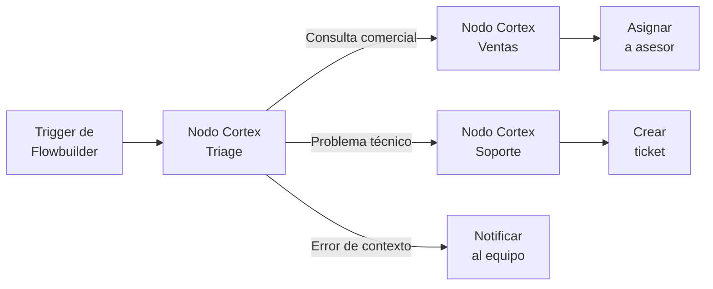
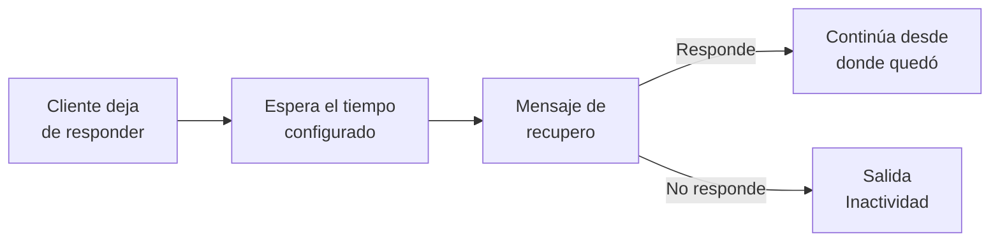

# 9. Integración con Flowbuilder

## El Nodo Cortex en Flowbuilder

> Estado en el manual original: **Borrador** · Tipo: Cómo se hace

> **En una línea:** cada Flujo Cortex publicado aparece en Flowbuilder como un nodo ejecutable, con salidas propias según cómo haya terminado la conversación.
> 

## Cómo funciona

Al llegar la ejecución al Nodo Cortex, se inicia la conversación completa del flujo con el contacto. Cuando la conversación termina, el control vuelve a Flowbuilder por la salida que corresponda.

Solo los flujos **publicados** aparecen en el selector. Ver 8.1.

## Configuración del nodo

En el panel lateral del nodo se selecciona qué Flujo Cortex ejecuta, de la lista de flujos publicados del workspace.

## Qué expone el nodo

| Qué | Detalle |
| --- | --- |
| Salidas dinámicas | Una por cada rama de finalización del flujo |
| Salidas operativas | Asignación a humano, error de contexto, inactividad y spam. Ver 9.2. |
| Campos capturados | Disponibles como variables para los nodos siguientes |
| Etapa del funnel | Etapa actual, máxima alcanzada y lista completa de etapas recorridas |
| Datos de trazabilidad | Se pasan al flow para reportería |

Si un flujo tiene las ramas Resuelto, Escalado y Abandonado, el nodo en Flowbuilder muestra esas tres salidas más las operativas.

## Varios Nodos Cortex en un mismo flow

Un flow puede tener tantos Nodos Cortex como necesite, sin límite estricto.

Cada uno es una instancia independiente: tiene su propio identificador, su propia configuración, sus propias conexiones y su propia trazabilidad.

Dos o más nodos pueden apuntar al **mismo Flujo Cortex**. La configuración del flujo se mantiene única —se define en Cortex— pero cada nodo del flow es una invocación separada.

### Casos de uso

| Patrón | Cómo se arma |
| --- | --- |
| Triage y especialización | Un primer flujo clasifica la consulta y, según el resultado, el flow deriva a un segundo flujo especializado en ventas, soporte o cobranzas |
| Validación intermedia | Un flujo captura datos, un nodo de Flowbuilder los valida contra el CRM, y un segundo flujo continúa con los datos validados |
| Re-contacto | Un primer flujo atiende la consulta, el flow espera N días, y un segundo flujo vuelve a contactar para encuesta o venta adicional |
| Reutilización | El mismo flujo de clarificación se usa en dos puntos distintos del flow cuando la conversación necesita reorientarse |

### Salidas cuando hay varios nodos

- Dos nodos que apuntan al mismo flujo exponen **las mismas salidas**, porque dependen del flujo y no del nodo.
- Dos nodos que apuntan a flujos distintos exponen salidas distintas.
- Las salidas operativas están presentes en todos.

### Contexto entre nodos

Cada Nodo Cortex del flow corre como una sesión conversacional continua con su historial. Cada uno recibe el historial de la sesión y los campos y etapas ya recolectados.

Esto evita que el flujo "se confunda" cuando se reutiliza en distintos puntos del flow con propósitos distintos.

> 💡
> **El paso de variables entre nodos es automático.** Los campos capturados por un nodo quedan disponibles para todos los siguientes, incluidos otros Nodos Cortex, sin configurar ningún mapeo. Lo mismo con la etapa del funnel y las tipificaciones aplicadas.

El resultado práctico es que el cliente no tiene que repetir información que ya dio en un tramo anterior del flow.

## Trazabilidad

Cada nodo del flow registra su ejecución por separado en los logs de Flowbuilder.

En los logs del flujo se puede filtrar por flow y por nodo, para ver las ejecuciones de un punto específico aunque el mismo flujo se invoque desde varios lugares.

En BigQuery, cada conversación persiste el identificador del nodo desde el cual fue invocada, lo que habilita reportería de rendimiento por nodo.

## Validaciones

**Cada Nodo Cortex del flow debe tener un flujo seleccionado** para poder publicar. Si alguno está vacío, el flow queda inválido. Ver 7.2.

No hay validación que impida repetir flujos ni que limite la cantidad de nodos.

## Fuera de alcance

- Mapeo explícito de variables entre nodos. En esta versión es automático, sin configuración.
- Ejecutar varios flujos en paralelo desde un único nodo. Se admiten varios nodos en serie o en ramas distintas, no simultáneos desde el mismo punto.
- Tope duro de cantidad de nodos por flow.
- Detección automática de bucles conversacionales entre nodos del mismo flujo.

## Relacionado

- 9.2 Mapa completo de salidas
- 9.4 Cortex en campañas salientes y contexto de origen
- 8.1 Borrador vs publicado
- 8.3 Publicar un flujo en uso

---

*Fuente: FRD base HU-17 · FRD Parte 4 HU-11 · Última revisión: 06/08/2026 · Responsable: Constanza Molina*

---

## Mapa completo de salidas

> Estado en el manual original: **Borrador** · Tipo: Referencia

> **En una línea:** todas las formas en que un Flujo Cortex puede terminar y qué recibe Flowbuilder en cada caso. La referencia completa para conectar el nodo.
> 

> 💡
> Este artículo existe porque la información está repartida en cinco FRD distintos. Es la referencia a consultar cuando hay que conectar las salidas de un Nodo Cortex en Flowbuilder.

## Las dos familias de salidas

|  | Dinámicas | Operativas |
| --- | --- | --- |
| De dónde salen | De los Nodos Fin que definió el builder | Del sistema, siempre presentes |
| Cuántas hay | Una por cada rama de finalización | Un conjunto fijo |
| Se pueden cambiar | Sí, agregando o quitando Nodos Fin | No |
| Significan | La conversación terminó como estaba previsto | La conversación terminó por una condición del sistema |

## Salidas dinámicas

Cada Nodo Fin del flujo expone una salida con el nombre de su rama de finalización.

Si el flujo tiene tres Nodos Fin —Cita agendada, Cotización enviada y No calificado— el nodo en Flowbuilder muestra esas tres salidas, más todas las operativas.

Agregar un Nodo Fin suma una salida. Eliminarlo o renombrarlo **rompe** lo que estuviera conectado ahí. Ver 8.3.

## Salidas operativas

### Asignación a humano

Se activa cuando el flujo determina que necesita intervención de una persona.

Incluye una **etiqueta configurable** que indica el área o equipo al que se deriva: Ventas, Atención, Soporte Técnico, Cobranzas. Esa etiqueta se configura en el prompt del nodo o como propiedad del Nodo Fin correspondiente, y se pasa a Flowbuilder como variable para enrutar a la cola correcta.

> 💡
> Una sola salida genérica de "derivado a humano" no le dice a Flowbuilder a qué equipo asignar. Conviene diferenciar por razón, porque cada cola tiene tiempos de respuesta distintos.

### Error de contexto

Se activa cuando el sistema detecta que la conversación quedó rota. Tres condiciones la disparan:

| Condición | Umbral |
| --- | --- |
| Timeout de respuesta del flujo | Más de 10 segundos sin producir respuesta |
| Bucle de transferencias entre nodos hermanos | Más de 4 traspasos consecutivos sin respuesta efectiva al cliente |
| Timeout de una herramienta | Más de 10 segundos sin responder |

Al dispararse, el sistema detiene la ejecución, cierra el flujo y sale por esta rama.

**Variables que expone:**

| Variable | Contenido |
| --- | --- |
| Tipo de error | Timeout del flujo, bucle de transferencias o timeout de herramienta |
| Detalle del error | Nombre del nodo o herramienta involucrada, cantidad de traspasos detectados |
| Último nodo activo | Dónde estaba la conversación antes del error |
| Última herramienta | Si el error fue por timeout de herramienta |

Los valores por defecto son seguros y no requieren intervención en la mayoría de los casos. Si esta salida se dispara seguido, el problema está en el diseño del flujo —condiciones que se solapan, herramientas lentas— y no en el umbral.

### Inactividad

Se activa cuando el cliente no responde después de completarse el proceso de recupero.

No es lo mismo que el cierre inmediato por falta de respuesta: primero corre el intento de reenganche, y recién si eso tampoco funciona sale por acá. Ver 9.3.

> ⚠️
> **Punto a confirmar.** Los FRD nombran de dos formas lo que parece el mismo comportamiento: una rama de finalización por defecto llamada "Sin respuesta" (creada automáticamente con cada Nodo Cortex) y una salida operativa llamada "Inactividad". Está registrado en ⚠️ Deuda y discrepancias.

### Spam detectado

Se crea automáticamente al activar el módulo anti-spam. Se dispara cuando una conversación se clasifica como spam, sin que el flujo responda el mensaje.

**Variables que expone:** el indicador de spam y el motivo detectado por el evaluador.

Si el módulo se desactiva, la rama deja de dispararse pero no se elimina del flow. Ver 2.5.

## Variables disponibles en todas las salidas

Independientemente de por dónde termine la conversación, Flowbuilder recibe:

| Variable | Contenido |
| --- | --- |
| Campos de guardado | Todos los capturados durante la conversación |
| Etapa actual | En qué etapa del funnel quedó |
| Etapa máxima alcanzada | La más alta del recorrido completo |
| Etapas alcanzadas | Lista completa con timestamps |
| Tipificaciones aplicadas | Todas las que se dispararon |
| Etiquetas aplicadas | Todas las acumuladas |
| Trazabilidad | Datos del recorrido para reportería |

## Cómo diseñar las salidas

La pregunta que define cada Nodo Fin es: **¿qué tiene que pasar después?**

Si dos salidas llevan a la misma acción en Flowbuilder, probablemente son una sola.

### Ejemplo de salidas bien diseñadas

| Salida | Acción en Flowbuilder |
| --- | --- |
| Cita agendada | Notificar al equipo comercial y programar recordatorio 24hs antes |
| Derivado a humano — Ventas | Asignar a la cola de ventas |
| Derivado a humano — Soporte | Asignar a la cola de soporte |
| No interesado | Etiquetar en el CRM y sumar a campaña de nutrición |
| Sin respuesta | Etiquetar en el CRM e intentar re-contacto en 7 días |

### Salidas redundantes

Resuelto, Cita agendada y Cliente satisfecho implican lo mismo aguas abajo. Conviene consolidarlas.

### Nombrar las salidas

Conviene usar verbos o estados concretos: Cita agendada, Cotización enviada, Derivado a asesor, No calificado.

Conviene evitar adjetivos vagos: Exitoso, Correcto, Fallido. No indican qué acción tomar.

## Escenarios que conviene cubrir

Todo flujo debería tener salida para al menos estos cinco casos. Si uno no está cubierto, el flujo lo va a resolver como pueda.

| Escenario | Cómo se cubre |
| --- | --- |
| Éxito | Nodo Fin propio |
| Escalamiento a humano | Salida operativa, diferenciada por razón |
| No aplica | Nodo Fin propio: el cliente busca algo que no se ofrece |
| Abandono | Salida operativa de inactividad |
| Estado inconsistente | Salida operativa de error de contexto |

## Relacionado

- 3.3 Nodos Fin y ramas de finalización
- 9.1 El Nodo Cortex en Flowbuilder
- 9.3 Recupero por inactividad
- 10.3 Diseñar condiciones de salida

---

*Fuente: FRD base HU-05 y HU-17 · FRD Parte 2 HU-1 · FRD Parte 3 HU-07 · FRD Parte 6 HU-19 · Buenas prácticas · Última revisión: 06/08/2026 · Responsable: Constanza Molina*

---

## Recupero por inactividad

> Estado en el manual original: **Borrador** · Tipo: Cómo se hace

> **En una línea:** cuando un cliente deja de responder, el sistema programa un mensaje contextualizado que intenta reengancharlo, en lugar de cerrar la conversación por tiempo.
> 

## El recorrido completo

El cierre por inactividad corre **después** del recupero, no en lugar de él.

## Configurar el tiempo de espera

El tiempo para considerar inactividad es configurable por flujo.

No hay un valor que sirva para todo. Depende del tipo de decisión que esté tomando el cliente.

| Caso de uso | Tiempo sugerido |
| --- | --- |
| Venta rápida o cotización | 15 a 30 minutos |
| Agendamiento de cita | 30 a 60 minutos |
| Soporte al cliente | 1 a 2 horas |
| Consultas informativas | 2 a 6 horas |
| Trámites que requieren buscar información | 6 a 12 horas |

> 💡
> Un tiempo de 5 minutos para una decisión de compra grande genera fricción. Un tiempo de 24 horas para coordinar un test drive hace que se pierda la ventana comercial.

## Qué contexto recibe el mensaje de recupero

El sistema programa el recupero mediante un planificador. El mensaje se genera con acceso al historial completo:

- Los mensajes intercambiados.
- El nodo en el que quedó la conversación.
- Los campos ya capturados.
- La etapa del funnel alcanzada.
- Las tipificaciones aplicadas.

Ese contexto es lo que permite que el mensaje sea específico y no genérico.

## Mensaje contextualizado, no genérico

| Conviene | Conviene evitar |
| --- | --- |
| "Quedamos revisando la propuesta del plan Enterprise. ¿Te gustaría que te envíe el detalle o preferís que te llame un asesor?" | "¿Sigues ahí?" |
| "Vi que estabas por confirmar la fecha del test drive del Corolla 2026. ¿Te sirve el sábado 15 a las 11 o preferís otro horario?" | "¿Nos quedó algo pendiente?" |

El prompt del recupero se configura desde la Configuración Global, en la misma sección donde se define el comportamiento sin respuesta. Ahí se ajusta el tono y la estrategia de reenganche.

## Tono

El cliente dejó de responder por alguna razón: se ocupó, no le interesó, se olvidó. Un tono urgente lo aleja.

| Conviene | Conviene evitar |
| --- | --- |
| "¿Te gustaría que agendemos un test drive para el Creta Grand?" | "¡No pierdas esta oportunidad! Necesito tu respuesta hoy." |

Conviene formular el recupero como una pregunta abierta que invite a retomar, no como un pedido de decisión inmediata.

## Cuántos intentos

**Por defecto, uno.**

> ⚠️
> Enviar varios recuperos consecutivos se percibe como acoso y quema al contacto. Si el caso lo justifica —un lead caliente que se cortó en medio de una compra— conviene un segundo intento otro día vía plantilla, no como recupero automático inmediato.

## Si el cliente responde

La conversación continúa normalmente en el flujo, desde el punto donde había quedado. Los campos capturados y la etapa alcanzada se conservan, así que no hay que volver a pedir nada.

## Si no responde

Pasado un tiempo configurable después del último intento, la sesión se cierra y el nodo sale por la salida operativa de **Inactividad** en Flowbuilder.

### El mensaje de cierre

Antes de cerrar conviene enviar un mensaje que reconozca cortésmente el fin de la conversación, deje la puerta abierta para retomar, e incluya idealmente una acción de bajo compromiso: un enlace a la web, el contacto de un asesor, un formulario.

> Entiendo que ahora no es el momento. Cuando quieras retomar, escribime acá y seguimos desde donde quedamos. ¡Gracias!
> 

## Trazabilidad

Los intentos de recupero y sus resultados se registran en la trazabilidad de la conversación: cuándo se programó, qué mensaje se envió, si el cliente respondió.

## Relacionado

- 9.2 Mapa completo de salidas
- 2.1 El panel de Configuración Global
- 3.3 Nodos Fin y ramas de finalización
- 10.5 Optimización de costos en WhatsApp

---

*Fuente: FRD Parte 3 HU-09 · FRD Parte 2 HU-1 · Buenas prácticas §17 · Última revisión: 06/08/2026 · Responsable: Constanza Molina*

---

## Cortex en campañas salientes y contexto de origen

> Estado en el manual original: **Borrador** · Tipo: Cómo se hace

> **En una línea:** conectar un Nodo Cortex después de una plantilla de WhatsApp o de un webhook, para que atienda la respuesta del cliente con el contexto de lo que ya pasó.
> 

## Los tres escenarios

| Escenario | Qué recibe el flujo |
| --- | --- |
| Después de una plantilla | El contenido de la plantilla enviada y la respuesta del cliente |
| Después de un webhook | Los datos del evento, mapeados a campos del flujo |
| Sobre una conversación con historial | El historial completo del mismo caso, incluidos los mensajes con asesores humanos |

## Conectar después de una plantilla

El Nodo Cortex se puede conectar directamente como nodo siguiente de un envío de plantilla de WhatsApp, de cualquier tipo.

Cuando la plantilla se envía y el cliente responde, esa respuesta se enruta al Nodo Cortex y el flujo toma la conversación desde ese turno.

| Situación | Comportamiento |
| --- | --- |
| El cliente responde | El flujo arranca con la plantilla y la respuesta como contexto |
| El cliente no responde en la ventana configurada | Se dispara la salida operativa de inactividad |
| La plantilla falla al enviarse | El Nodo Cortex no se ejecuta. El flow sigue por su camino de error. |

### Ejemplo

Una concesionaria lanza una campaña con la plantilla *"¿Te interesa probar el nuevo Toyota Hilux 2026?"*.

El flow es: trigger de campaña → enviar plantilla → Nodo Cortex de test drive.

El cliente responde *"Sí, me interesa"*. El flujo recibe la plantilla original más la respuesta, y continúa pidiendo zona y horario preferido — sin volver a explicar de qué se trata.

## Conectar después de un webhook

El Nodo Cortex también se puede conectar como nodo siguiente de un webhook entrante.

Cuando el webhook se dispara, su contenido queda disponible como variables del flow. Desde la configuración del Nodo Cortex se mapea cada variable a un campo del flujo.

El flujo arranca con esos campos ya poblados, sin pedírselos al cliente.

### La sección Contexto de entrada

Al hacer click en el Nodo Cortex dentro de Flowbuilder aparece una sección con dos pestañas:

| Pestaña | Cuándo aparece | Qué permite |
| --- | --- | --- |
| Desde plantilla | Se activa sola cuando el nodo está conectado después de una plantilla | Confirmar qué plantilla se envía y que el flujo la recibirá como contexto |
| Desde webhook o variables | Cuando hay variables del flow disponibles | Mapear cada variable del flow a un campo del flujo |

Si el nodo está conectado después de un nodo conversacional tradicional, la sección no aparece.

### Validaciones

- Flowbuilder valida en tiempo de diseño que la conexión entrante sea de un tipo soportado.
- Si el flujo espera campos obligatorios que no están mapeados, aparece un aviso: el flujo esperará a que el cliente los proporcione en la conversación.
- Si se mapea una variable a un campo de tipo incompatible, se muestra error de validación.

## Contexto de una conversación con historial

Cuando el flujo se activa sobre una conversación que ya tiene historial bajo el mismo caso, recibe automáticamente ese historial como contexto.

Incluye los turnos del cliente, los de asesores humanos si los hubo, los de otros flujos o bots previos, los mensajes del sistema como notas y transferencias, y cualquier campo capturado antes.

El historial se inyecta en el prompt como una sección dedicada con formato claro, para que el LLM lo interprete como contexto y no como instrucciones.

> 💡
> El caso típico: un cliente venía hablando con un asesor humano sobre un reclamo, y el asesor lo deriva a un flujo automatizado para recopilar datos. Sin contexto, el flujo saludaría y preguntaría en qué puede ayudar, ignorando que el cliente ya explicó su problema.

### Configuración

En la Configuración Global aparece una sección con tres switches, para desactivar cada tipo de contexto por separado si hace falta:

- Contexto del caso, activado por defecto.
- Contexto de plantilla, activado cuando el flow incluye plantillas.
- Contexto de webhook, activado cuando hay un mapeo configurado.

### Cómo aprovecharlo en el prompt

El prompt tiene que estar preparado para recibir contexto previo. Si no, el flujo puede saludar como si fuera el primer contacto aunque tenga toda la información.

Ante una contradicción entre el contexto previo y lo que el cliente dice en su primer turno, el flujo prioriza lo más reciente y consulta si hace falta.

## Contexto de anuncio de origen

Cuando el cliente llega desde un anuncio de Click-to-WhatsApp, el sistema detecta la URL del anuncio, extrae su contenido y se lo entrega al flujo como contexto adicional.

Así el flujo arranca sabiendo exactamente qué anuncio vio el cliente.

### Cómo funciona

1. Llega un mensaje que incluye la referencia al anuncio de origen.
2. El sistema registra la URL en la conversación.
3. Se extrae el contenido de esa URL en segundo plano, sin bloquear el primer turno.
4. El resultado queda disponible como campo de contexto para el flujo.

El builder ajusta en el prompt cómo usar ese contexto. Por ejemplo: revisar de qué anuncio viene el cliente y adaptar el saludo a lo que ese anuncio promocionaba, mencionando el modelo o el beneficio ofrecido.

### Ejemplo

Una concesionaria promociona el Toyota Corolla 2026 con 15% de descuento. Un cliente hace click y escribe *"Hola, quiero información"*.

**Sin este contexto:** *"¡Hola! ¿En qué puedo ayudarte?"*

**Con este contexto:** *"¡Hola! Vi que venís desde nuestro anuncio del Toyota Corolla 2026. Te confirmo que tiene el 15% de descuento vigente esta semana. ¿Te gustaría que te pase la ficha completa y coordinemos un test drive?"*

El cliente pasa de contacto anónimo a lead calificado en el primer mensaje, y se ahorran dos o tres turnos de calificación.

### Si falla la extracción

Si la URL está caída o el contenido bloqueado, el campo queda vacío, se registra el error y el flujo arranca sin ese contexto.

### Qué se persiste

La URL del anuncio, el contenido extraído, el timestamp y si la extracción fue exitosa. Todo eso se persiste en BigQuery, lo que permite analizar conversión por anuncio: qué campañas generan leads que llegan a etapas avanzadas y cuáles se quedan en el primer contacto.

En la vista de detalle de la conversación aparece un indicador de origen con la URL, una sección expandible con el contenido extraído, y un enlace al anuncio original.

## Simular flujos de campaña

El simulador de Flowbuilder ejecuta el Nodo Cortex también cuando el flow es de campaña saliente.

| Con plantilla | Con webhook |
| --- | --- |
| La plantilla se muestra como mensaje saliente en el chat del simulador | Antes de iniciar, se ingresa un contenido de prueba del webhook |
| Se escribe una respuesta como si fuera el cliente | El simulador ejecuta el mapeo configurado y arranca con los campos poblados |
| Al enviarla, se ejecuta el Nodo Cortex con la plantilla y la respuesta como contexto | Se pueden guardar contenidos de prueba reutilizables y elegir cuál usar |

Si la plantilla tiene variables, el simulador permite ingresar valores de ejemplo antes de enviarla.

Toda la funcionalidad del simulador sigue disponible: visualización de invocaciones de herramientas, mensajes citados, indicador de escritura y cierre sin perder el flujo.

Si el flow tiene varios Nodos Cortex encadenados, el simulador los ejecuta en secuencia pasando el contexto entre ellos.

> 💡
> Antes de esto, probar una campaña obligaba a publicarla y enviarse mensajes a uno mismo desde un número de prueba.

## Fuera de alcance

- Contexto desde canales distintos al que se está usando.
- Reprocesar el contexto previo si el cliente responde después de mucho tiempo.
- Editar manualmente el contexto previo antes de pasarlo al flujo.
- Simular con datos reales de clientes históricos.
- Detección de origen de anuncio en canales distintos de WhatsApp.
- Anuncios que requieren autenticación para leer su contenido.
- Varias URLs de anuncio en una misma conversación.

## Relacionado

- 9.1 El Nodo Cortex en Flowbuilder
- 2.4 Reconocimiento de cliente y memoria
- 7.1 El simulador
- 10.5 Optimización de costos en WhatsApp

---

*Fuente: FRD Agent Builder para Outbound HU-01, HU-02 y HU-03 · FRD Parte 6 HU-17 · Última revisión: 06/08/2026 · Responsable: Constanza Molina*

---

